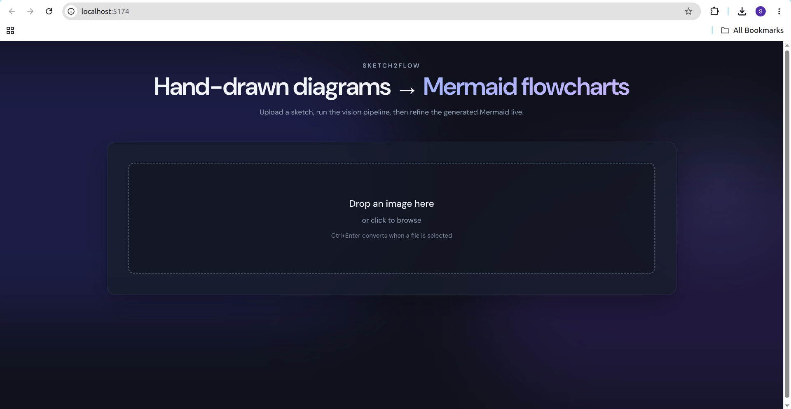
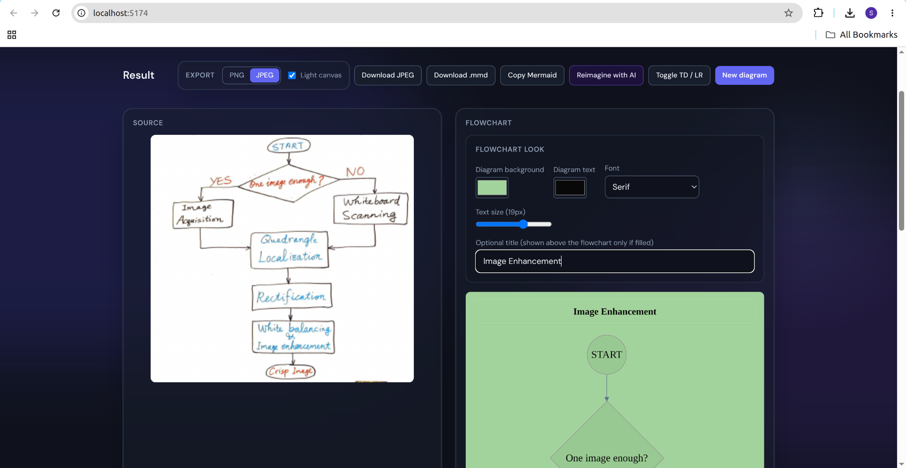
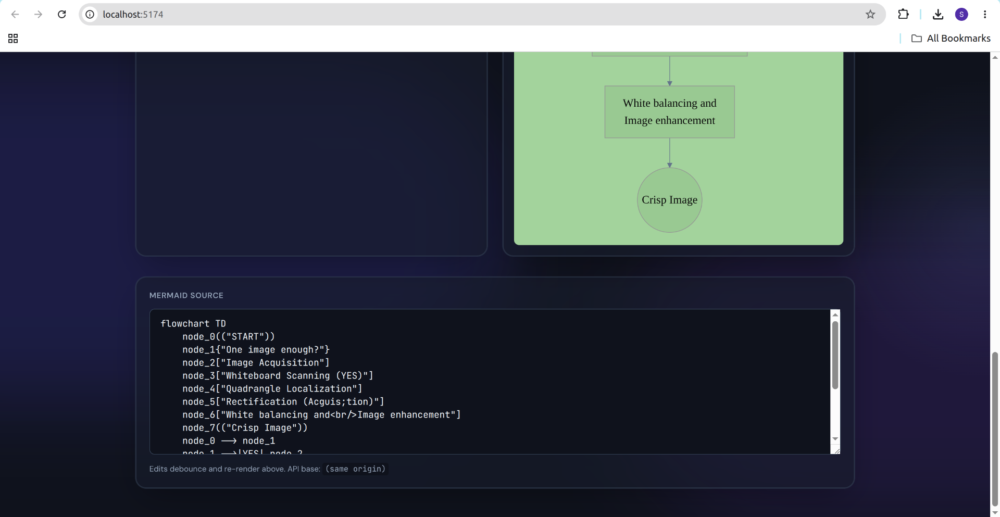
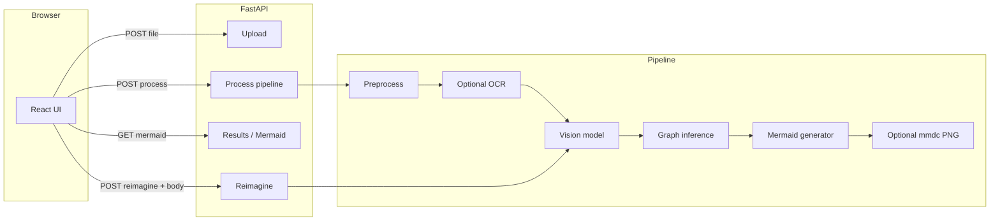

# Sketch2Flow

Turn **hand-drawn flowcharts** (pen and paper, whiteboards, notebook scans) into **editable [Mermaid](https://mermaid.js.org/)** diagrams. A **FastAPI** pipeline runs preprocessing, optional OCR, and a configurable **vision LLM**; a **React + TypeScript** UI previews the chart, lets you tune appearance and export PNG/JPEG, and calls a **Reimagine** endpoint to refine structure against your latest editor text.

---

## Why this project

- **End-to-end product**: upload → async job → live Mermaid editor → client raster export and optional server PNG via `mmdc`.
- **Clear separation**: vision produces structured JSON; a small **inference** layer builds a graph; **Mermaid generation** is deterministic from that graph.
- **Modern UI**: TanStack Query, Tailwind, Framer Motion, scoped flowchart theming (not global app chrome), optional title block composited into exports.

Good fit for a portfolio or resume when you want to show **multimodal AI**, **Python services**, and **React** in one repo.

---

## Screenshots

Here are some screenshots of the application in action:

### 1. Hero Section


### 2. Diagram Processing


### 3. Mermaid Source Editor


---

## Architecture



---

## Tech stack

| Layer | Choices |
|--------|---------|
| API | FastAPI, Uvicorn, Pydantic settings |
| Vision | Pluggable: **stub**, **Google Gemini**, **OpenAI** (image → JSON graph) |
| OCR | Optional **EasyOCR** |
| Diagram | Custom inference → **Mermaid** text; optional **@mermaid-js/mermaid-cli** for `diagram.png` |
| Frontend | Vite, React 18, TypeScript, TanStack Query, Tailwind, Framer Motion, Mermaid.js |
| Dev UX | `Makefile` + `scripts/dev-all.sh` (venv, installs, API + Vite in one terminal) |

---

## Features

- **Upload** a sketch (drag-and-drop or file picker); **Ctrl+Enter** starts conversion from the upload screen.
- **Pipeline**: preprocess → optional OCR → vision JSON → graph merge → **Mermaid**; optional **server-side PNG** when `mmdc` is on `PATH`.
- **Result UI**: live Mermaid textarea with debounced preview; **flowchart-only** colours, font, size, optional **title** above the chart; **PNG / JPEG** export with optional **light canvas**; copy and **.mmd** download; **Toggle TD / LR**; **Reimagine with AI** (second vision pass).
- **Reimagine** sends `{ "mermaid": "<your editor text>" }` so the model refines what you see, not only the last saved `diagram.mmd` on disk (empty body still falls back to the file).

---

## Requirements

- **Python** 3.10+
- **Node.js** 18+ (for the frontend dev server and production build)

---

## Quick start

```bash
git clone https://github.com/<you>/Sketch2Flow.git
cd Sketch2Flow

python3 -m venv venv
source venv/bin/activate          # Windows: venv\Scripts\activate
pip install -r backend/requirements.txt

cp .env.example .env              # set VISION_PROVIDER and API keys as needed

chmod +x scripts/dev-all.sh       # first time only
./scripts/dev-all.sh              # or: make dev-all
```

Open **http://localhost:5173** (Vite proxies `/api` to the API on port **8000**). API docs: **http://127.0.0.1:8000/docs**.

### Environment variables

See [.env.example](.env.example). Highlights:

| Variable | Role |
|----------|------|
| `VISION_PROVIDER` | `stub` (no keys), `gemini`, or `openai` |
| `ENABLE_OCR` | `true` / `false` (alias: `ENABLE_OCR_FALLBACK`) |
| `GEMINI_API_KEY`, `GEMINI_MODEL_NAME` | Gemini |
| `OPENAI_API_KEY` | OpenAI |
| `BACKEND_CORS_ORIGINS` | Comma-separated origins if the UI is not same-origin (e.g. explicit `VITE_API_BASE` without Vite proxy) |

**Never commit `.env`**—it is listed in `.gitignore`.

---

## Production-style run (single origin)

Build the SPA into `backend/static`, then serve only the API (static files are mounted from that folder):

```bash
cd frontend && npm install && npm run build
cd .. && ./venv/bin/uvicorn backend.main:app --reload --host 0.0.0.0 --port 8000
```

Open **http://localhost:8000**. If the UI was not built, `/` returns JSON with build instructions.

### Optional: server PNG

Install [Mermaid CLI](https://github.com/mermaid-js/mermaid-cli) (`mmdc`) globally or on `PATH`. Jobs can then emit `diagram.png`; without it, jobs may finish as `completed_with_warnings` while the UI still supports **client-side** PNG/JPEG export.

---

## Development (two terminals)

**API**

```bash
./venv/bin/uvicorn backend.main:app --reload --host 0.0.0.0 --port 8000
```

**Frontend** (proxies `/api` to `http://127.0.0.1:8000`)

```bash
cd frontend && npm run dev
```

Use **http://localhost:5173**. Alternatively set `VITE_API_BASE` and configure CORS.

---

## Makefile

| Target | Purpose |
|--------|---------|
| `make dev-all` | One terminal: venv (if needed), installs, backend + Vite |
| `make install` | venv + `pip` + `npm install` only |
| `make dev-backend` | Uvicorn only |
| `make dev-frontend` | Vite only |
| `make test` | Pytest |

---

## Testing

```bash
./venv/bin/pip install -r backend/requirements.txt
./venv/bin/python -m pytest tests -q --ignore=tests/integration_test.py
```

`make test` uses the same command. The script below is a **manual** HTTP smoke test (requires a running API):

```bash
./venv/bin/python tests/integration_test.py
```

---

## API overview

| Method | Path | Description |
|--------|------|----------------|
| `POST` | `/api/v1/upload` | Multipart image → `job_id` |
| `POST` | `/api/v1/process/{job_id}` | Start pipeline |
| `GET` | `/api/v1/status/{job_id}` | Poll status / artifacts |
| `GET` | `/api/v1/results/{job_id}/mermaid` | Fetch `diagram.mmd` text |
| `GET` | `/api/v1/results/{job_id}/png` | Server PNG when present |
| `POST` | `/api/v1/reimagine/{job_id}` | JSON body `{ "mermaid": "..." }` (optional); overwrites `diagram.mmd` |

OpenAPI: `/api/v1/openapi.json` and `/docs`.

---

## Repository layout

| Path | Contents |
|------|----------|
| [backend/](backend/) | FastAPI app, pipeline services, Mermaid CLI wrapper |
| [frontend/](frontend/) | Vite React app (build output goes to `backend/static/`) |
| [scripts/](scripts/) | `dev-all.sh` helper |
| [tests/](tests/) | Pytest + optional integration script |

---

## Contributing

Issues and pull requests are welcome. Please keep changes focused, match existing style, and run `make test` plus `cd frontend && npm run build` before submitting.

---

## CI

GitHub Actions (`.github/workflows/ci.yml`) runs **pytest** on `tests/` (excluding `integration_test.py`, which needs a live API) and **`npm ci` + `npm run build`** in `frontend/` on every push and pull request.

---

## Checklist before your first push

1. Copy `.env.example` → `.env` locally only; never commit `.env`.
2. Run `cd frontend && npm run build` once so `backend/static/` exists for local single-origin runs (that folder is gitignored).
3. Replace `https://github.com/<you>/Sketch2Flow.git` in [Quick start](#quick-start) with your real clone URL (optional).

---

## License

[MIT License](LICENSE) — see the `LICENSE` file in the repository root.
